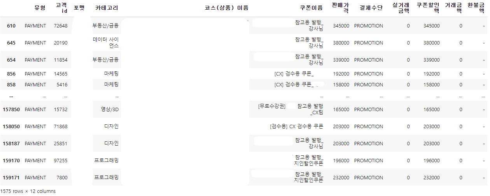

# EDA : Refund Defense Analysis

참여자 : 박사무엘, 배태양, 조인철, 박수영, 김민주

---

**프로젝트 기간:** 2023.5 ~ 2022.6 (3weeks)

**프로젝트 도구:** Github  
**사용 언어:** Python Pandas Numpy Matplotlib

---

 

### ****프로젝트 개요****

- 기업의 실제 연매출 데이터를 분석하고 정보를 토대로 매출증진을 위한 기획 전략 프로젝트
- 데이터 분석을 위한 시각화 진행 & 데이터 based 기획 수립

### 프로젝트 배경

- 기업의 새로운 매출 증진 방안이 필요
- 이를 위한 실제 기업의 매출 데이터에 영향을 끼치는 요인 분석이 필요

**문제 정의**

-  소비자의 최종적 소비 행위(구매 및 환불)에 영향을 미치는 요인을 분석하기 위해 실제 기업의 상품 구매 및 환불 현황을 살펴보고, 이를 시각화하고자 한다.
또한 분석한 데이터를 통해 소비행위 고취 및 환불행위 방어 등의 수익화 방안을 탐색하고자 한다.

- 가설
    + 데이터에는 환불이 적지 않게 포착하였다.
      * 환불이 많은 과목은 소비자에게 만족도가 적다고 가정하였다.
      * 환불이 적은 과목은 반대로 만족도가 높다고 가정하였다.

 

### 프로젝트 진행 과정

1. 데이터 탐색
2. 데이터 전처리
3. 시각화
4. Data based 기획 수립

 

### 프로젝트 구현 내용

1. **데이터 탐색**

- 데이터 셋은 연계한 기업의 연 매출 데이터를 사용했습니다.

-  데이터 탐색
    + 데이터 유형: csv 파일
    + columns
        * 거래id : 거래행위 고유 ID
        * 유형 : 소비자 최종 행위 (Payment/Refund)
        * 고객id : 고객 고유 ID
        * 코스id : 상품 고유 ID
        * 사이트 : 거래가 이루어진 사이트
        * 포맷: 강의 유형
        * 카테고리 : 강의 상세 카테고리
        * 코스 : 강의 이름
        * 거래일자 : 거래한 일자
        * 쿠폰 이름 : 사용 된 쿠폰의 이름
        * 판매가격 : 사이트에 공시된 강의 판매 가격
        * 결제수단 : 결제 방식
        * 실거래 금액 : 기타 혜택을 사용하여 실제로 거래한 금액
        * 쿠폰 할인액 : 강의 결제 시 쿠폰에 의해 할인 되는 금액
        * 거래 금액 : 거래 완료된 최종 금액
        * 환불 금액 : 강의를 환불시 환불 되는 금액

매출에 큰 영향을 끼치는 요인이 구매와 환불이 확인된다.
그래서 환불 방어를 통한 수익 증진을 고려 & 이를 위한 전처리을 진행했다.

  

2. **데이터 전처리**

1. 거래 id → 분석 목적에 부합하지 않은 변수 
2. 코스 ID → 중복 데이터
3. 사이트 →  모두 ‘동일한’ 값
4. 거래일자 →  분석 목적에 부합하지 않은 변수 

제거 근거  : 본 연구와 연관성이 부족한, 영향을 주지 않는 컬럼.

쿠폰 이름에 ( 참고 | 검수 | 내부 | 조교 | 인턴 | test | 미리보기 | 확인 ) 이 포함되는 행 확인했다.
- ⇒ 시스템 확인 차 직원 및 검수용으로 사용된 쿠폰
- ⇒ 이에,  본 행들은 분석에 방해가 되는 요소이기에 정확한 분석을 위해 제거 
- → [불필요한 데이터를 삭제]

  

3. **시각화 및 기획 수립**

 

판매 제품의 비율을 통해 매출을 책임지는 제품들을 알 수 있었다. 이를 통해 수립한 전략

Top3 가 매출과 59%, Top5가 매출 76.5 % 매출을 책임지니, 이 제품군들의 환불을 막는 것 만으로 높은 수익으로 창출이 가능하다.

 

 

제가 담당한 분석을 통해 아래의 수립을 도출 할 수 있었다.  
데이터 사이언스, 일러스트, 디자인 92% 구매와 8% 환불 비율로 가장 큰 환불 비율로 확인이 되었다.
- 기초 지식 필요로 하는 제품 군들 사이에서 소비자들의 개인의 역량의 부족으로 환불 되는 이유들이 많이 확인 되는 것으로 사료
- 또는 기초 능력이 있는 소비자들이 실질적으로 원하는 제품이 아니였던 경우로 사료

 

위를 통해 제품의 단가가 높을 수 록, 환불 건 또한 적다.
인과관계를 크게 가지기 어려웠지만, 비싼 단가는 제품의 퀄리티 또한 높고 만족도 또한 크게 달성을 한 것으로 사료

    

 

마지막으로 프로모션 분석을 통해 최종적인 데이터 기반의 2가지 전략을 수립을 했습니다.

- 첫째, 가장 기본적인 5만원 이하의 적은 금액의 프로모션을 통해 간단한 상품를 맛보게하는 기회를 유도하여 다음 상품의 구매를 유도하는 기획
- 둘째, 소비자들을 대상으로 많은 10 ~ 30 만원의 제품들의 파격적인 프로모션을 통하여 제품의 진입 장벽 난이도를 한 단계를 완하하여 만족도를 충족해주는 기획

  

최종적으로 2가지의 기획 전략을 수립 했습니다.

- 배경: 데이터 사이언스 제품등 어려운 제품군의 경우, 소비는 많지만 구매확정으로 이어지지 않고 환불 비율이 높은 클래스이다. 즉, 소비자의 니즈를 제대로 파악하지 못하는 것으로 판단된다. 이에 좀 더 강의의 목적이 구체화되고 탄탄한 커리큘럼 방향성을 새로 제시 해주는 로드맵을 통해 소비를 유도 할 수 있을 것 같습니다.

- 제안
    + 강의 내용의 목적성과 방향성이 세분화 되고 가격과 제품의 난이도가 무겁지 않은 즉 ‘허들이 낮은’ 제품군의 리스트업이 추가적으로 필요하다고 사료됩니다.
    + 기간 구독제나 패스형의 상품을 기획할 경우 다양한 소비자들의 니즈를 충족할 수 있는 대안이 될 수 있다고 생각합니다. 이에 수익화 증대에 긍정적인 효과를 낼 으로 사료됩니다. 단, 수익 구조를 해치지 않기 위해  특정 프리미엄 강의(RED) 나 인기 카테고리 별 강의는 제한 할 필요가 있다.
---

   

### 프로젝트 한계 및 개선 방안

**한계**

- 여러 가설을 증명함에 인과관계등 어려움이 있음
- 팀원들과 동시에 같은 데이터를 기반으로 기획을 제안을 하다보니 누구의 기획이 더 올바른 방향인지 찾는 등 커뮤케이션의 어려움이 존재 하였음
- 초기에 진행한 프로젝트이다 보니 분석 logic이 주관적인건 아닌지 검증하는 부분이 아쉬웠음

 

**개선 방안**

- 추가적인 인과관계를 찾는 분석과 A/B 테스트등 여러 통계적 분석을 통해 실제로 기획이 유의미한지 볼 수 도 있음
- 설문등 표분에 대한 데이터 수급
